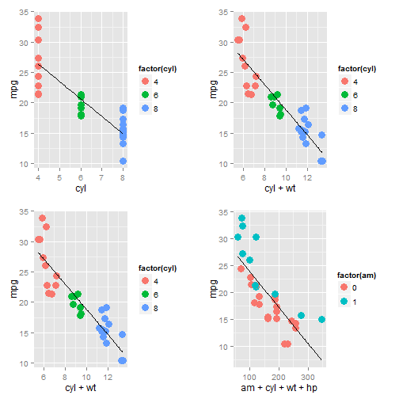

Executive Summary
========================================================
<h3>Synopsis</h3>

The purpose of this project is to look at a data set of a collection of cars.We are interested in exploring the relationship between a set of variables and miles per gallon (MPG) (outcome). We want to answer following two questions:

-"Is an automatic or manual transmission better for MPG"
-"Quantify the MPG difference between automatic and manual transmissions"
<h3>Summary</h3>
Studying ther results of the linear regression and multi variable linear regression we find that automatic transmission is better for MPG but impact of transmission type on MPG is lowered when considered with other variables.

For linear regression the MPG increasses 7.245 MPG , whereas if we consider other important variables like cylinder type , weight and horse power the increase in MPG is about 1.809 MPG.


---

## Build and Analyze Linear Regression Models

Models for analyzing the mtcars dataset


```r
#7 modles for analysis
model1<-lm(mpg~am,data=data)
model2<-lm(mpg~cyl,data=data)
model3<-lm(mpg~cyl+wt,data=data)
model4<-lm(mpg~cyl+wt+hp,data=data)
model5<-lm(mpg~am+cyl+wt+hp,data=data)
model6<-lm(mpg~.,data=data)
model7<-lm(mpg~ wt + qsec + am,data=data)
```

---

## Regression analysis


```
## Error in library(ggplot2): there is no package called 'ggplot2'
```

```
## Error in eval(expr, envir, enclos): could not find function "ggplot"
```

```
## Error in eval(expr, envir, enclos): could not find function "ggplot"
```

```
## Error in eval(expr, envir, enclos): could not find function "ggplot"
```

```
## Error in eval(expr, envir, enclos): could not find function "ggplot"
```

 

```
## Error in print(p1, vp = vplayout(1, 1)): object 'p1' not found
```

```
## Error in print(p2, vp = vplayout(1, 2)): object 'p2' not found
```

```
## Error in print(p3, vp = vplayout(2, 1)): object 'p3' not found
```

```
## Error in print(p4, vp = vplayout(2, 2)): object 'p4' not found
```


---

## Shinny App and Source Code
- <h3>Shiny App hosted </h3>
    https://tuhinmahmud.shinyapps.io/regressionAnalysis/RM_project.Rmd
- <h3> Source code </h3>
    https://github.com/tuhinmahmud/RegressionModelApp


---


